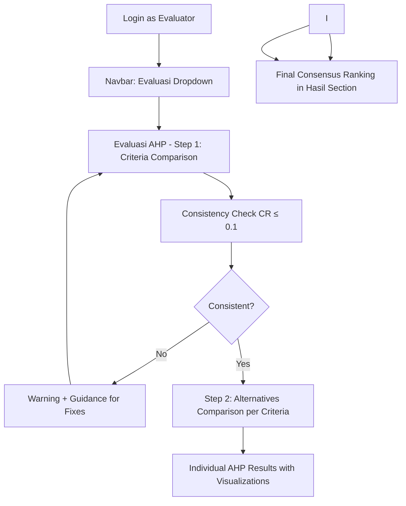

# 🏢 GDSS - Group Decision Support System

> **Sistem Pendukung Keputusan Kelompok untuk Prioritas Proyek IT**  
> Menggunakan metode **Analytic Hierarchy Process (AHP)** + **BORDA** Aggregation

[](https://php.net)
[](https://mysql.com)
[](https://getbootstrap.com)

## 📋 Deskripsi Project

GDSS adalah implementasi sistem pendukung keputusan kelompok yang memfasilitasi pengambilan keputusan bersama antara **3 decision maker** (Tim Teknis, Administrasi, dan Keuangan) dalam menentukan prioritas proyek IT menggunakan metode **AHP** untuk evaluasi individual dan **BORDA** untuk konsensus akhir.

## 🎯 Fitur Utama

### ✅ **Metode AHP (Analytic Hierarchy Process)**
- **Perbandingan Berpasangan**: Skala Saaty 1-9 dengan UI intuitif dan step-by-step navigation
- **Validasi Konsistensi**: CR ≤ 0.1, warning otomatis dengan guidance untuk perbaikan
- **Priority Vector**: Eigenvalue method untuk perhitungan bobot yang akurat
- **Global Scoring**: Agregasi kriteria × alternatif untuk ranking individual per bidang
- **Real-time Results**: Visualisasi hasil dengan Chart.js dan progress indicators

### ✅ **Multi-Decision Maker System**
- **3 Role Evaluator**: Teknis (5 kriteria), Administrasi (4 kriteria), Keuangan (3 kriteria)
- **Role-based Access Control**: Navbar dan fitur disesuaikan dengan peran pengguna
- **Systematic Navigation**: Dropdown grouping - Management, Evaluasi, Hasil
- **Individual Evaluation**: Setiap DM melakukan AHP secara independen dengan validation
- **Supervisor Dashboard**: Kelola proyek, monitor progress, dan finalisasi konsensus

### ✅ **BORDA Consensus Method**  
- **Weighted Aggregation**: Teknis (53.8%), Administrasi (30.8%), Keuangan (15.4%)
- **Final Ranking**: Konsensus berdasarkan agregasi hasil AHP dari semua bidang
- **Transparency**: Dashboard menampilkan kontribusi dan breakdown per bidang
- **Finalization Control**: Supervisor dapat memfinalisasi konsensus dengan tracking status

## 🛠 Tech Stack

- **Backend**: PHP 8+ dengan PDO MySQL
- **Frontend**: HTML5, CSS3, Bootstrap 5, Chart.js
- **Database**: MySQL/MariaDB
- **Server**: Apache/Nginx atau PHP Built-in Server

## 📁 Struktur Project

```
gdss-web/
├── 📄 Core Files
│   ├── index.php              # Login page
│   ├── dashboard.php          # Main dashboard
│   ├── config.php             # Database configuration
│   └── functions.php          # Core functions
│
├── 🧮 AHP Implementation
│   ├── ahp_comparison.php     # Pairwise comparison forms with step navigation
│   └── ahp_results.php        # Individual AHP results & consistency validation
│
├── 📊 Evaluation & Results  
│   ├── evaluate.php           # BORDA method evaluation (alternative method)
│   ├── results.php            # Final consensus results with BORDA aggregation
│   └── projects.php           # Project management (supervisor only)
│
├── 📂 Organized Folders
│   ├── assets/                # CSS, images, static files
│   ├── sql/                   # Database scripts
│   ├── docs/                  # Documentation
│   ├── tests/                 # Test files
│   └── uploads/               # File uploads
│
└── 🔧 Configuration
    ├── .gitignore             # Git ignore rules
    └── logout.php             # Session cleanup
```

## 🚀 Quick Start

### 1. **Setup Database**
```sql
-- Import database schema
mysql -u root -p < sql/install_gdss.sql

-- Run AHP schema update
mysql -u root -p gdss_db < sql/update_ahp_schema.sql

-- Clean up database (optional)
mysql -u root -p gdss_db < sql/simple_cleanup.sql
```

### 2. **Configure Application**
```php
// Edit config.php
define('DB_HOST', 'localhost');
define('DB_NAME', 'gdss_db');  
define('DB_USER', 'root');
define('DB_PASS', 'your_password');
```

### 3. **Start Application**
```bash
# Using PHP Built-in Server
php -S localhost:8000

# Or use Apache/Nginx
# Access: http://localhost/gdss-web/
```

### 4. **Login with Demo Accounts**
| Username | Password | Role | Navbar Access | Evaluation Scope |
|----------|----------|------|---------------|-------------------|
| `supervisor` | `admin123` | Supervisor | Management + Hasil | Project management, finalize consensus |
| `teknis01` | `teknis123` | Teknis | Management + Evaluasi + Hasil | Technical AHP evaluation (5 criteria) |
| `administrasi` | `admin123` | Administrasi | Management + Evaluasi + Hasil | Administrative AHP evaluation (4 criteria) |
| `keuangan01` | `keuangan123` | Keuangan | Management + Evaluasi + Hasil | Financial AHP evaluation (3 criteria) |

## 🔄 AHP Evaluation Workflow



## 🧪 Testing & Debugging

```bash
# Test database connection & setup
http://localhost:8000/tests/test.php

# Test AHP mathematical functions
http://localhost:8000/tests/test_ahp.php

# Check all system components
# All tests should show ✅ green checkmarks
```

## 📊 AHP Mathematical Implementation

### **1. Pairwise Comparison Matrix Construction**
```php
// Build matrix from Saaty 1-9 scale user inputs
$matrix = buildPairwiseMatrix($comparisons, $elementIds);
// Auto-populate reciprocal values (aij = 1/aji)
```

### **2. Priority Vector Calculation (Eigenvalue Method)**
```php  
// Eigenvalue method for precise weight calculation
$priorities = calculatePriorityVector($matrix);
// Normalized eigenvector of maximum eigenvalue
```

### **3. Consistency Validation with User Guidance**
```php
$consistency = calculateConsistency($matrix, $priorities);
// CI = (λmax - n) / (n - 1)
// CR = CI / RI (Random Index)
// CR ≤ 0.1 = Consistent ✅, CR > 0.1 = Needs revision ⚠️
if (!$consistency['is_consistent']) {
    // Show warning with specific guidance for improvement
}
```

### **4. Global Score Calculation & Individual Results**
```php
// Multi-level hierarchy: Criteria weights × Alternative scores
$globalScores = calculateAHPGlobalScores($criteriaPriorities, $alternativePriorities);
// Individual ranking per evaluator before BORDA aggregation
```

### **5. Real-time Visualization & Feedback**
```javascript
// Chart.js doughnut charts for criteria weights
// Progress indicators for evaluation completion
// Interactive consistency warnings with actionable advice
```

## 🏆 BORDA Aggregation Formula

```php
Final_Score = (7/13 × Teknis_AHP) + (4/13 × Administrasi_AHP) + (2/13 × Keuangan_AHP)
```

**Weight Rationale:**
- **Teknis (7/13)**: Highest weight - technical feasibility crucial for IT projects
- **Administrasi (4/13)**: Medium weight - process & compliance considerations  
- **Keuangan (2/13)**: Lower weight - budget constraint but not primary factor

## 🎨 User Interface Highlights

- **🎨 Modern Bootstrap 5 Design**: Responsive interface with Poppins typography
- **📊 Interactive Visualizations**: Chart.js doughnut charts for criteria priorities
- **🔄 Systematic Navigation**: Logical navbar grouping (Management/Evaluasi/Hasil)
- **⚠️ Real-time Validation**: Consistency warnings with actionable guidance
- **🏆 Comprehensive Results**: Multi-tab dashboard with methodology explanation
- **📱 Role-based Interface**: Dynamic navbar based on user permissions
- **✨ Visual Feedback**: Progress bars, badges, and status indicators throughout

## 🧭 Navigation System

### **Systematic Navbar Structure**
```php
// Management Dropdown (All Users)
├── Dashboard - System overview and statistics
└── Kelola Proyek - Project management (supervisor only)

// Evaluasi Dropdown (Evaluators Only)  
├── Evaluasi BORDA - Alternative ranking method
└── Evaluasi AHP - Primary AHP evaluation workflow

// Hasil Section (All Users)
└── Hasil - Final consensus results and rankings
```

### **Role-based Access Control**
- **Supervisor**: Management + Hasil (no individual evaluation access)
- **Evaluators**: Management + Evaluasi + Hasil (full evaluation workflow)
- **Dynamic UI**: Navbar adapts automatically based on user role and permissions

## 🔒 Security Features

- **CSRF Protection**: All forms protected against cross-site request forgery
- **Session Management**: Secure session handling with proper cleanup
- **Role-based Access**: Strict access control per user role with redirect protection
- **Input Validation**: Server-side validation for all user inputs and AHP matrices
- **SQL Injection Protection**: PDO prepared statements throughout
- **Consistency Validation**: Mathematical validation prevents invalid AHP matrices

## 📈 Recent Updates & Improvements

### ✅ **Completed (v2.0)**
- **Consistent Navbar Structure**: Systematic Management/Evaluasi/Hasil grouping across all pages
- **Enhanced AHP Terminology**: Accurate methodology descriptions throughout the system
- **Role-based Navigation**: Dynamic navbar based on user permissions (supervisor vs evaluators)
- **Improved Results Dashboard**: Multi-tab interface with comprehensive methodology explanation
- **Visual Consistency**: Uniform icons, styling, and user experience patterns

### 🚀 **Future Enhancements**
- [ ] **Export Functionality**: PDF reports for decision documentation
- [ ] **Sensitivity Analysis**: What-if scenarios for weight changes  
- [ ] **Multi-language Support**: Indonesian + English interface
- [ ] **Email Notifications**: Alert DMs for pending evaluations
- [ ] **Audit Trail**: Complete decision-making process logging
- [ ] **REST API**: Integration with external project management systems
- [ ] **Mobile App**: Native mobile application for on-the-go evaluations

## 🤝 Contributing

This is an academic project implementing research-based decision support methodology. Contributions welcome for:

- Algorithm optimizations
- UI/UX improvements  
- Additional mathematical methods
- Performance enhancements
- Security improvements

## 📄 License

Academic project - Educational use only. Based on research methodology from peer-reviewed publications.

---

**🎓 Academic Implementation of Group Decision Support System using AHP + BORDA methodology**  
*Faithful implementation for educational and research purposes*